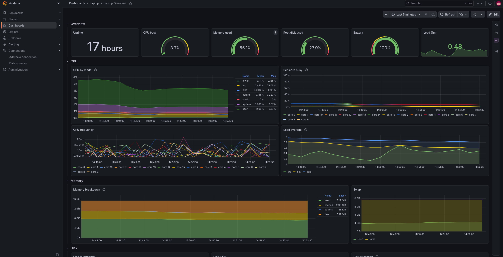
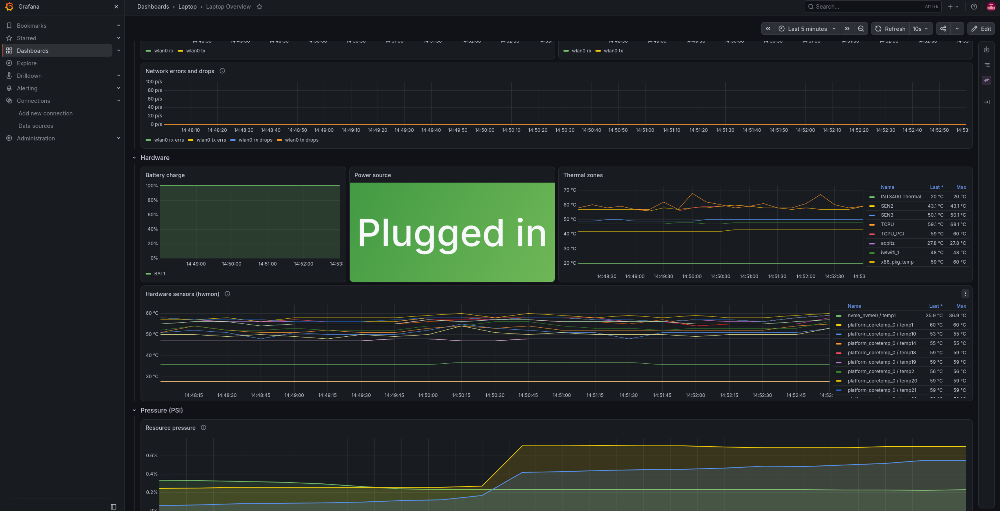

# Laptop Monitoring

A small monitoring stack for my Linux laptop, running in Docker. It collects CPU, memory,
disk, filesystem, network and temperature stats and draws them on a Grafana dashboard.

Everything here runs locally and is bound to `127.0.0.1`, so nothing is exposed to the
network I happen to be connected to.



Further down the same dashboard: network, battery, temperatures and resource pressure.



## The three pieces

Monitoring is usually split into three jobs, and this uses one tool for each:

| Tool | What it does | Port |
| --- | --- | --- |
| **Node Exporter** | Reads the kernel's stats out of `/proc` and `/sys` and serves them as a web page | 9100 |
| **Prometheus** | Fetches that page every 15 seconds and keeps the history in a database | 9090 |
| **Grafana** | Asks Prometheus for numbers and draws the graphs | 3000 |

The flow is just: **Node Exporter → Prometheus → Grafana**.

Node Exporter has no memory — ask it for stats and it tells you what's true right now, and
nothing else. Prometheus is what turns that into history. Grafana stores no data at all; every
graph is a live query.

## Running it

You need Docker and Docker Compose.

```bash
git clone <this repo>
cd laptop-monitoring

cp .env.example .env       # then edit .env and set a real password
docker compose up -d
```

Then open **http://127.0.0.1:3000** and log in with what you put in `.env`.
The dashboard is already there under **Dashboards → Laptop → Laptop Overview** — nothing to
import or click, it loads itself from `grafana/dashboards/`.

Useful commands:

```bash
docker compose ps            # what's running
docker compose logs grafana  # when something misbehaves
docker compose down          # stop (metrics are kept)
docker compose down -v       # stop and delete all collected metrics
```

## What's in the repo

```
docker-compose.yml                              the three services
prometheus/prometheus.yml                       what to scrape and how often
grafana/provisioning/datasources/prometheus.yml connects Grafana to Prometheus
grafana/provisioning/dashboards/dashboards.yml  tells Grafana where dashboards live
grafana/dashboards/laptop-overview.json         the dashboard itself
.env.example                                    which secrets you need to set
docs/images/                                    screenshots for this README
```

Grafana is set up entirely through those **provisioning** files rather than by clicking in the
UI. Anything configured through the UI would only live inside Grafana's own database, which
isn't in Git — so it wouldn't survive a rebuild and couldn't be shared. Config as files means
`git clone && docker compose up` gives you a working dashboard on any machine.

The dashboard is deliberately **read-only in the UI**. To change a panel, edit the JSON, save,
and refresh the browser — Grafana rescans the folder every 10 seconds.

## What's deliberately not in Git

- **The metrics database and Grafana's database** live in Docker named volumes
  (`prometheus_data`, `grafana_data`), which sit in `/var/lib/docker/volumes`. They're outside
  the project folder entirely, so they can't be committed by accident.
- **The admin password** lives in `.env`, which is gitignored. `.env.example` is committed so
  you know which variables to set, but never holds a real value.

## Why everything uses host networking

This is the one unusual decision, so it's worth writing down.

Node Exporter's job is reading the kernel's files. But a container gets its **own** network
namespace, and network stats come from `/proc/net/dev`, which is *per namespace*. So a normal
containerised Node Exporter reports on the container's virtual interface — it would show an
`eth0` that doesn't exist on this laptop, and never show `wlan0`. Mounting `/proc` doesn't fix
it, because `/proc/net` is a symlink to `/proc/self/net` and `self` is always the process doing
the reading.

The only real fix is `network_mode: host`, so the process actually lives in the host's network
namespace.

Once Node Exporter is there, Prometheus has to cross a namespace boundary to scrape it — which
failed here for three separate reasons (`host.docker.internal` points at the *default* bridge,
`docker0` was down, and `ufw` blocks bridge-to-host traffic anyway). Putting Prometheus and
Grafana in the host namespace as well makes every hop a plain loopback connection and removes
that whole category of problem.

The trade-off: no Docker DNS names between the services, and no network isolation between them.
On a single-user laptop that's fine. On a shared server I'd use an isolated bridge instead.

Side effect worth knowing: with `network_mode: host`, a `ports:` block does nothing —
Docker even warns about it. The bind address has to be set on the process instead, which is why
each service has an explicit `--web.listen-address=127.0.0.1:...` or `GF_SERVER_HTTP_ADDR`.

## A few other decisions

- **Image versions are pinned** (`v1.9.1`, `v3.6.0`, `13.2.1`) rather than `:latest`, so a
  clone in six months gets the same software and the dashboard still works.
- **Prometheus keeps 30 days or 5 GB**, whichever comes first. The size cap means it can never
  fill the SSD.
- **`veth*` and `br-*` interfaces are filtered out** at the exporter. Every container started
  creates a new random interface name, and each name would become a permanent new time series
  in Prometheus.
- **The datasource has a fixed `uid`.** Grafana generates a random one otherwise, which would
  differ on every fresh install and break every panel with "Datasource not found".

## If something looks wrong

Check the chain from the bottom up — whichever step fails first is the broken one:

```bash
curl -s localhost:9100/metrics | head            # 1. is Node Exporter collecting?
curl -s 127.0.0.1:9090/api/v1/targets            # 2. is Prometheus scraping? both should be "up"
curl -s 127.0.0.1:3000/api/health                # 3. is Grafana alive?
```

If a container's behaviour doesn't match the config, check what it actually got rather than
trusting the file — they drift apart easily:

```bash
docker inspect grafana --format '{{range .Mounts}}{{.Destination}}{{println}}{{end}}'
docker inspect node-exporter --format '{{range .Config.Cmd}}{{println .}}{{end}}'
```
